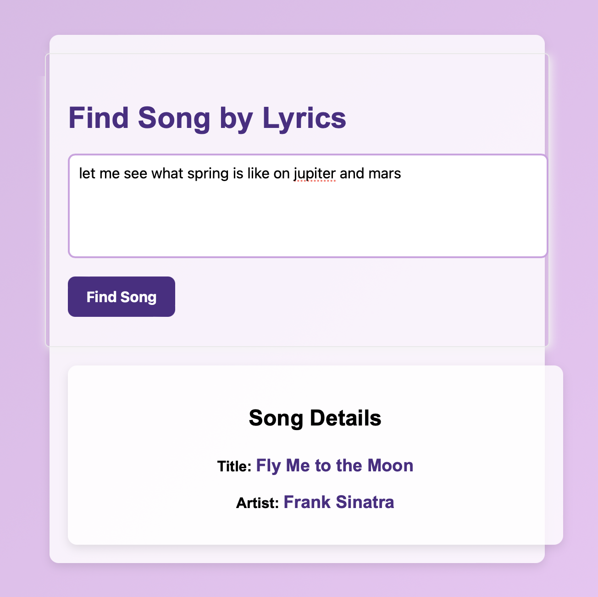

# Find My Song

## Made with LangChain!

Enter song lyrics into Find My Song, and if it can find it, it'll give you the title of the song and the artist's name by using LLM's and LangChain.

## Technologies

    
    
    

    
    

